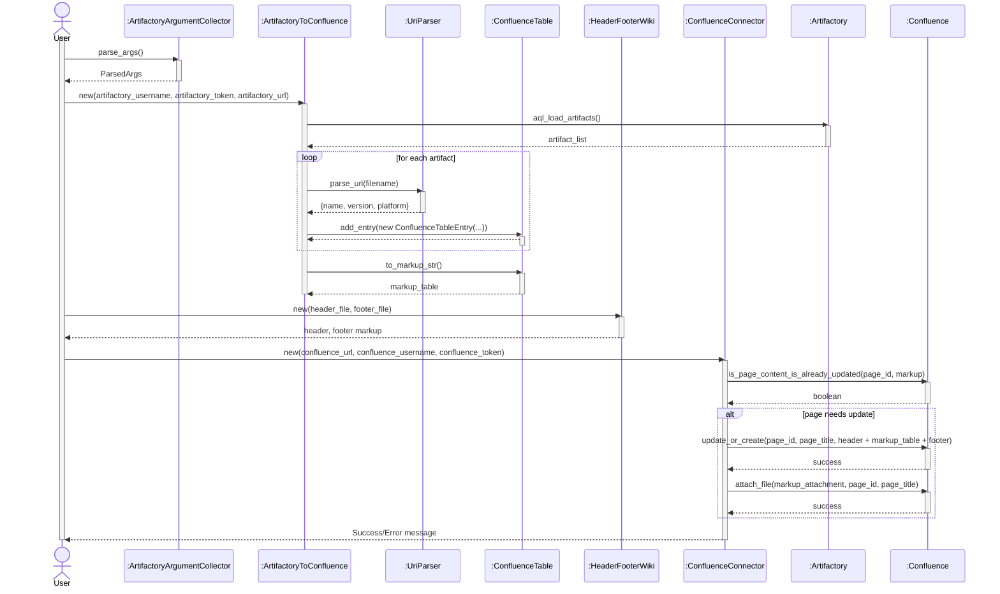

# Portfolio: Artifactory to Confluence Updater Project

## Project Overview
This project is a Python-based automation tool designed to fetch artifact metadata from a JFrog Artifactory repository, process it into a structured table format, and update a Confluence page with the latest package informations. It involves API integration, data parsing, command-line argument handling, and content generation for collaboration tools in Atlassian environments. 

Features:
- Querying Artifactory using AQL (Artifactory Query Language) to retrieve artifact lists and properties.
- Parsing artifact filenames to extract name, version, and platform details when properties are missing.
- Generating Wiki markup for Confluence tables, including headers, footers, and warnings.
- Updating or creating Confluence pages via the Atlassian API, with rate-limiting handling.
- Attaching markup files as backups to Confluence pages.

The full source code is not publicly available in the repository; only a README file is provided for overview purposes.

## Notable Used Tools and Libraries:
- **Python 3**: Core language for scripting.
- **argparse**: For handling command-line arguments.
- **Artifactory (artifactory-python-client)**: To interact with Artifactory APIs.
- **Atlassian Confluence API (atlassian-python-api)**: For Confluence page updates and attachments.
- **requests**: For HTTP requests in Confluence interactions.
- **tqdm**: For progress bars during artifact loading.
- **re (Regular Expressions)**: For URI parsing and string manipulation.
- **datetime**: For formatting upload dates.
- **os and sys**: For file and system operations.

## Project Structure and Key Components
The project consists of several modular Python files, each handling a specific aspect:

1. **artifactory_argument_collector.py**:
   - Defines an `ArtifactoryArgumentCollector` class.
   - Uses `argparse` to collect mandatory arguments (e.g., usernames, tokens for Artifactory and Confluence, page ID) and optional ones (e.g., URLs, page titles, header/footer files).
   - Ensures secure handling of credentials.

2. **artifactory_to_confluence.py**:
   - Core logic in the `ArtifactoryToConfluence` class.
   - Connects to Artifactory, loads artifacts via AQL, parses URIs, and extracts properties (e.g., Name, Version, Platform, Changes, OpenSource, License).
   - Builds `ConfluenceTableEntry` objects and assembles them into a `ConfluenceTable`.
   - Generates Wiki markup strings for the table.
   - Handles fallback parsing if properties are absent.

3. **header_footer_wiki.py**:
   - `HeaderFooterWiki` class reads optional header and footer text files (in Confluence Wiki markup).
   - Appends these to the generated table for complete page content.

4. **confluence_updater.py**:
   - `ConfluenceConnector` class manages Confluence sessions.
   - Updates or creates pages with markup.
   - Checks if content is already up-to-date to avoid unnecessary updates.
   - Downloads and uploads attachments (e.g., markup backups).
   - Implements rate-limiting sleeps to prevent API errors.

5. **uri_parser.py**:
   - `UriParser` class uses regex to break down artifact filenames into components (name, version, platform).
   - Handles various filename patterns with separators like `-` or `_`.

6. **confluence_table.py**:
   - `ConfluenceTable` class (inherits from `list`) manages table entries.
   - Defines a fixed header and sorts entries by name, version, and platform.
   - Converts entries to Wiki markup.

7. **confluence_table_entry.py**:
   - `ConfluenceTableEntry` class represents a single row in the table.
   - Formats fields like open source status with licenses into markup.

Supporting files:
- **header.txt** and **footer.txt**: Sample Wiki markup for warnings (e.g., "Automatic Generation Warning").
- **markup_wiki.txt**: Example output markup with a table.

## Challenges and Solutions
- **Parsing Inconsistent Filenames**: Artifacts may lack properties, so regex-based fallback in `UriParser` ensures extraction.
- **API Rate Limits**: Added sleep intervals in Confluence interactions.
- **Sorting Versions**: Handled semantic versioning with numeric splitting.
- **Security**: Tokens/passwords are passed via arguments, avoiding hardcoding.

## UML Sequence Diagram: Project Flow
Below is a UML-compliant sequence diagram illustrating the high-level flow of the project, using explicit lifelines, synchronous (closed arrow) and asynchronous (open arrow) messages, and proper interaction notation (e.g., loops, alternatives):

